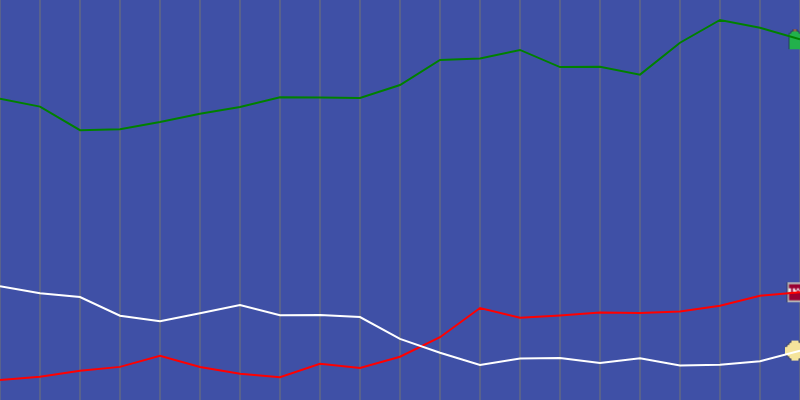

# Stock Market Graph 
The purpose of this code is to create a graph given data. 

The goal is to implement logic to simulate the stock market and include it on future game projects.

The functions for generating prices comes from [Cookie Clicker's stock market](https://cookieclicker.fandom.com/wiki/Stock_Market) since it's a random but "realistic" approach.

A generated graph looks like this:

